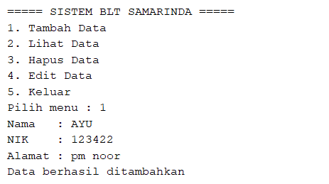
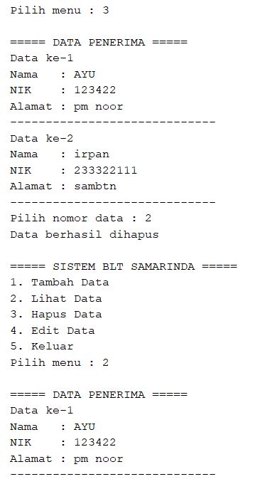
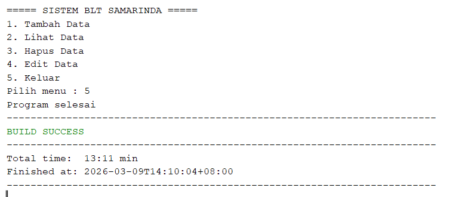

# Sistem Layanan Penerimaan Bantuan Langsung Tunai (BLT) Kota Samarinda

## Deskripsi Program

Program ini merupakan aplikasi berbasis **Java Console** yang dibuat untuk membantu pengelolaan data **penerima Bantuan Langsung Tunai (BLT)** di Kota Samarinda.

Program ini memungkinkan pengguna untuk:

* Menambahkan data penerima bantuan
* Melihat daftar penerima bantuan
* Menghapus data penerima bantuan
* Mengedit data penerima bantuan

Program dibuat menggunakan konsep dasar **Object Oriented Programming (OOP)** dengan menggunakan **class**, **object**, **ArrayList**, dan **method**.

---

## Tujuan Program

Tujuan dari pembuatan program ini adalah:

1. Mengimplementasikan konsep **Object Oriented Programming (OOP)** dalam Java.
2. Membuat sistem sederhana untuk mengelola data penerima bantuan.
3. Melatih penggunaan **ArrayList** sebagai penyimpanan data dinamis.
4. Melatih penggunaan **Scanner** untuk input data dari pengguna.

---

## Struktur Program

Program terdiri dari dua class utama:

### 1. Class `PenerimaBantuan`

Class ini digunakan untuk menyimpan data penerima bantuan.

#### Atribut

* `nama` : Nama penerima bantuan
* `nik` : Nomor Induk Kependudukan
* `alamat` : Alamat penerima bantuan

#### Method

* `tampilkanData()`
  Menampilkan data penerima bantuan ke layar.

Contoh struktur class:


```java
class PenerimaBantuan {
    String nama;
    String nik;
    String alamat;
}
```

---

### 2. Class `LayananBLTSamarinda`

Class ini merupakan **class utama (main class)** yang menjalankan program.

Class ini memiliki beberapa komponen:

#### Variabel Global

* `ArrayList<PenerimaBantuan> daftar`
  Digunakan untuk menyimpan daftar penerima bantuan.
* `Scanner input`
  Digunakan untuk membaca input dari pengguna.

#### Method yang Digunakan

1. **main()**
   Method utama untuk menjalankan program dan menampilkan menu.

2. **tambahData()**
   Digunakan untuk menambahkan data penerima bantuan ke dalam ArrayList.

3. **lihatData()**
   Digunakan untuk menampilkan seluruh data penerima bantuan.

4. **hapusData()**
   Digunakan untuk menghapus data penerima bantuan berdasarkan nomor data.

5. **editData()**
   Digunakan untuk memperbarui data penerima bantuan.

---

## Fitur Program

Program ini memiliki beberapa fitur utama:

### 1. Tambah Data

Pengguna dapat memasukkan:


*Gambar 1. tambah data.*

Data kemudian akan disimpan ke dalam **ArrayList**.

---

### 2. Lihat Data

Program akan menampilkan seluruh data penerima bantuan yang sudah tersimpan.

Contoh tampilan:


*Gambar 2. lihat data.*

---

### 3. Hapus Data

Pengguna dapat menghapus data dengan memasukkan **nomor data** yang ingin dihapus.


*Gambar 3. hapus data.*

---

### 4. Edit Data

Pengguna dapat memperbarui data penerima bantuan dengan memilih nomor data yang ingin diedit.


*Gambar 4. hapus data.*

---

### 5. Keluar

Pengguna dapat memperbarui data penerima bantuan dengan memilih nomor data yang ingin diedit.


*Gambar 5. keluar.*

---


## Struktur Menu Program

Saat program dijalankan, akan muncul menu berikut:

```
===== SISTEM BLT SAMARINDA =====
1. Tambah Data
2. Lihat Data
3. Hapus Data
4. Edit Data
5. Keluar
```

Pengguna memilih menu dengan memasukkan angka sesuai pilihan.

---

## Cara Menjalankan Program

1. Buka project di **Apache NetBeans**.
2. Pastikan file utama berada pada package:

```
com.mycompany.layananbltsamarinda
```

3. Jalankan program dengan menekan:

```
Run Project (F6)
```

4. Program akan berjalan pada **terminal console** NetBeans.

---

## Teknologi yang Digunakan

* Bahasa Pemrograman: **Java**
* IDE: **Apache NetBeans**
* Struktur Project: **Maven Project**

---

## Konsep Pemrograman yang Digunakan

Beberapa konsep pemrograman yang digunakan dalam program ini:

* Object Oriented Programming (OOP)
* Class dan Object
* Method
* ArrayList
* Perulangan (Looping)
* Percabangan (Switch Case)
* Input Output menggunakan Scanner

---

## Kesimpulan

Program **Layanan BLT Samarinda** merupakan aplikasi sederhana berbasis Java yang dapat digunakan untuk mengelola data penerima bantuan secara sistematis.

Dengan memanfaatkan konsep **Object Oriented Programming**, program ini dapat dikembangkan lebih lanjut menjadi sistem yang lebih kompleks seperti:

* Penyimpanan database
* Interface GUI
* Sistem validasi data

---

## Author

Nama: Ayu Azzhahrah Alwi
NIM: 2409106022
Kelas: A1'24

---
