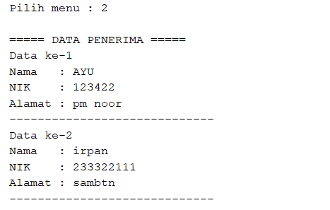

# Posttest 2

## Sistem Layanan Penerimaan Bantuan Langsung Tunai (BLT) Kota Samarinda

---

# Deskripsi Program

Program **Sistem Layanan Penerimaan Bantuan Langsung Tunai (BLT) Kota Samarinda** merupakan aplikasi berbasis **Java Console** yang digunakan untuk mengelola data penerima bantuan.

Program ini merupakan **pengembangan dari Posttest 1**, dengan menambahkan penerapan konsep **Encapsulation**, **Access Modifier**, serta penggunaan **Getter dan Setter** sesuai dengan konsep **PBO**.

Data penerima bantuan disimpan menggunakan **ArrayList**, sehingga program dapat melakukan operasi **CRUD (Create, Read, Update, Delete)** terhadap data penerima bantuan.

---

# Konsep yang Digunakan

## 1. Encapsulation

Encapsulation merupakan konsep dalam **PBO** yang digunakan untuk menyembunyikan data dalam sebuah class sehingga tidak dapat diakses langsung dari luar class.

Dalam program ini, atribut pada class `PenerimaBantuan` dibuat **private**, sehingga tidak bisa diakses secara langsung dari class lain.

Contoh:

```java
private String nama;
private String nik;
private String alamat;
```

Akses terhadap atribut tersebut hanya dapat dilakukan melalui **getter dan setter**.

---

## 2. Access Modifier

Access Modifier digunakan untuk mengatur tingkat akses suatu class, atribut, atau method.

Pada program ini digunakan dua jenis access modifier:

### 1. Private

Digunakan pada atribut class.

```java
private String nama;
```

Artinya atribut hanya dapat diakses di dalam class tersebut.

### 2. Public

Digunakan pada method getter dan setter.

```java
public String getNama()
public void setNama(String nama)
```

Artinya method dapat diakses dari class lain.

---

## 3. Getter dan Setter

Getter digunakan untuk **mengambil nilai dari atribut**, sedangkan setter digunakan untuk **mengubah nilai atribut**.

### Contoh Getter

```java
public String getNama() {
    return nama;
}
```

### Contoh Setter

```java
public void setNama(String nama) {
    this.nama = nama;
}
```

Dengan cara ini, data dapat dikontrol sebelum diubah.

---

# Struktur Program

Program terdiri dari dua class utama:

## 1. Class `PenerimaBantuan`

Class ini digunakan untuk merepresentasikan **data penerima bantuan**.

### Atribut

* `nama`
* `nik`
* `alamat`

Semua atribut dibuat **private** untuk menerapkan encapsulation.

### Method

* Getter dan Setter untuk setiap atribut
* `tampilkanData()` untuk menampilkan data penerima bantuan

---

## 2. Class `LayananBLTSamarinda`

Class ini merupakan **class utama** yang menjalankan program.

Class ini berfungsi untuk:

* Menampilkan menu program
* Mengelola data penerima bantuan
* Menjalankan operasi CRUD

---

# Fitur Program

Program memiliki beberapa fitur utama:

## 1. Tambah Data (Create)

Pengguna dapat menambahkan data penerima bantuan dengan memasukkan:


*Gambar 1. tambah data.*

Data kemudian disimpan dalam **ArrayList**.

---

## 2. Lihat Data (Read)

Program akan menampilkan seluruh data penerima bantuan yang tersimpan.

Contoh tampilan:


*Gambar 2. lihat data.*

---

## 3. Hapus Data (Delete)

Pengguna dapat menghapus data penerima bantuan berdasarkan nomor data.


*Gambar 3. hapus data.*

---

## 4. Edit Data (Update)

Pengguna dapat memperbarui data penerima bantuan yang sudah tersimpan.

Perubahan data dilakukan menggunakan **method setter**.


*Gambar 4. hapus data.*

---

# Struktur Menu Program

Saat program dijalankan, pengguna akan melihat menu berikut:

```
===== SISTEM LAYANAN BLT SAMARINDA =====
1. Tambah Data Penerima
2. Lihat Data Penerima
3. Hapus Data
4. Edit Data
5. Keluar
```

Program akan terus berjalan hingga pengguna memilih menu **Keluar**.

---

# Cara Menjalankan Program

1. Buka project di **Apache NetBeans**.
2. Pastikan file utama berada pada package:

```
com.mycompany.layananbltsamarinda
```

3. Jalankan program dengan menekan:

```
Run Project (F6)
```

4. Program akan berjalan pada **terminal console NetBeans**.

---


# Kesimpulan

Program **Sistem Layanan Penerimaan Bantuan Langsung Tunai (BLT) Kota Samarinda** pada Posttest 2 berhasil menerapkan konsep **Encapsulation** dalam Object Oriented Programming.

Dengan membuat atribut menjadi **private** serta menyediakan **getter dan setter**, data menjadi lebih aman dan terkontrol. Program juga tetap mendukung operasi **CRUD** menggunakan **ArrayList**, sehingga data penerima bantuan dapat dikelola dengan mudah.

Konsep ini sangat penting dalam pengembangan perangkat lunak karena membantu menjaga keamanan data dan meningkatkan kualitas kode program.

---

# Author

Nama : *Ayu Azzhahrah ALwi*
NIM : *2409106022*
Kelas : A1'24

---

