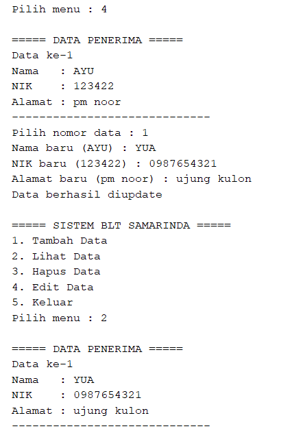

# Posttest 3

## Sistem Layanan Penerimaan Bantuan Langsung Tunai (BLT) Kota Samarinda

---

# Deskripsi Program

Program ini merupakan pengembangan dari Posttest sebelumnya, yaitu sistem pengelolaan data **Penerima Bantuan Langsung Tunai (BLT)** berbasis **Java Console**.

Pada Posttest 3, program telah dikembangkan dengan menerapkan konsep **Inheritance (Pewarisan)** dalam PBO, sehingga struktur program menjadi lebih modular, reusable, dan terorganisir.

Program ini tetap mendukung fitur:

* CRUD (Create, Read, Update, Delete)
* Menu interaktif
* Penyimpanan data menggunakan **ArrayList**

---

# Tujuan Posttest

Tujuan dari Posttest 3 adalah:

1. Mengimplementasikan konsep **Inheritance** dalam Java.
2. Mengembangkan program dari Posttest sebelumnya.
3. Menerapkan relasi **is-a relationship** yang logis.
4. Menggunakan minimal 2 subclass (pada program ini menggunakan 3 subclass).
5. Menggabungkan konsep PBO:

   * Encapsulation
   * Inheritance
   * Polymorphism (opsional/bonus)

---

# Konsep yang Digunakan

## 1. Inheritance (Pewarisan)

Inheritance adalah konsep dimana sebuah class dapat mewarisi atribut dan method dari class lain.

Pada program ini digunakan:

```java
class PenerimaReguler extends PenerimaBantuan
```

Artinya:

> PenerimaReguler adalah PenerimaBantuan

---

## 2. Jenis Inheritance

Program ini menggunakan:

### Hierarchical Inheritance

```text
PenerimaBantuan
 ├─ PenerimaReguler
 ├─ PenerimaUMKM
 └─ PenerimaLansia
```

Penjelasan:

* 1 superclass
* Memiliki lebih dari 1 subclass

---

## 3. Encapsulation

Atribut dalam class dibuat menggunakan access modifier:

* `protected` → agar bisa diwariskan ke subclass
* `private` → untuk atribut khusus subclass

Contoh:

```java
protected String nama;
private String usaha;
```

---

## 4. Getter dan Setter

Digunakan untuk mengakses dan mengubah nilai atribut.

Contoh:

```java
public String getNama()
public void setNama(String nama)
```

---

## 5. Method Overriding

Subclass dapat mengganti method dari parent class.

Contoh:

```java
@Override
public void jenisBantuan() {
    System.out.println("Jenis Bantuan: BLT UMKM");
}
```

---

# Struktur Program

Program terdiri dari beberapa class dalam satu file:

## 1. Superclass

### `PenerimaBantuan`

Berisi:

* atribut umum (nama, nik, alamat)
* method umum
* getter dan setter

---

## 2. Subclass

### a. `PenerimaReguler`

* Tidak memiliki atribut tambahan
* Override method jenis bantuan

### b. `PenerimaUMKM`

* Memiliki atribut tambahan: `usaha`
* Override method tampilkanData()

### c. `PenerimaLansia`

* Memiliki atribut tambahan: `umur`
* Override method tampilkanData()

---

## 3. Main Class

### `LayananBLTSamarinda`

Berfungsi untuk:

* Menjalankan program
* Menampilkan menu
* Mengelola data (CRUD)
* Menggunakan polymorphism melalui ArrayList

---

# Fitur Program

## 1. Tambah Data (Create)

User dapat memilih jenis penerima:

* Reguler
* UMKM
* Lansia

---

## 2. Lihat Data (Read)

Menampilkan semua data penerima bantuan.

Contoh tampilan:


*Gambar 2. lihat data.*

---

## 3. Hapus Data (Delete)

Menghapus data berdasarkan nomor.


*Gambar 3. hapus data.*

---

## 4. Edit Data (Update)

Mengubah data menggunakan setter.


*Gambar 4. edit data.*

---

# Contoh Tampilan Program

```text
===== SISTEM BLT SAMARINDA =====
1. Tambah Data
2. Lihat Data
3. Hapus Data
4. Edit Data
5. Keluar
```

---

# Perkembangan dari Posttest Sebelumnya

| Posttest   | Perubahan                     |
| ---------- | ----------------------------- |
| Posttest 1 | CRUD + ArrayList              |
| Posttest 2 | Encapsulation + Getter Setter |
| Posttest 3 | Inheritance + Subclass        |

---

# Kesimpulan

Program ini berhasil mengimplementasikan konsep **Inheritance** dengan baik menggunakan **Hierarchical Inheritance**.

Dengan adanya subclass:

* Program menjadi lebih fleksibel
* Data lebih spesifik sesuai jenis bantuan
* Kode lebih terstruktur dan mudah dipelihara

Selain itu, program juga tetap mempertahankan konsep:

* Encapsulation
* CRUD
* Penggunaan ArrayList

---

Nama  : *Ayu Azzhahrah Alwi*
NIM   : *2409106022*
Kelas : *A1'24*

---
